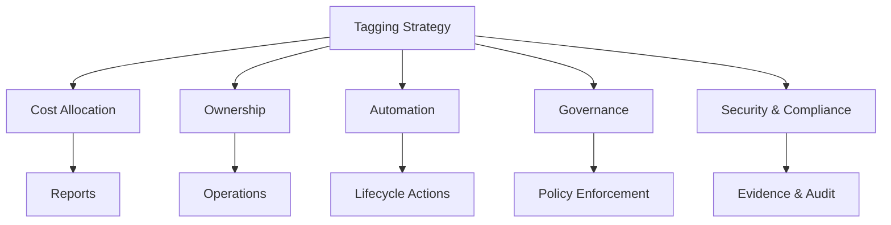

# AWS Resource Tagging Blueprint

A governance model for tagging AWS resources across ownership, cost, security, automation, and compliance.

## Diagram

## Recommended Tag Categories

- Business: business-unit, project, cost-center
- Ownership: owner, application, support-team
- Environment: dev, test, staging, prod
- Operations: backup, patching, lifecycle
- Compliance: data-classification, regulatory-scope
