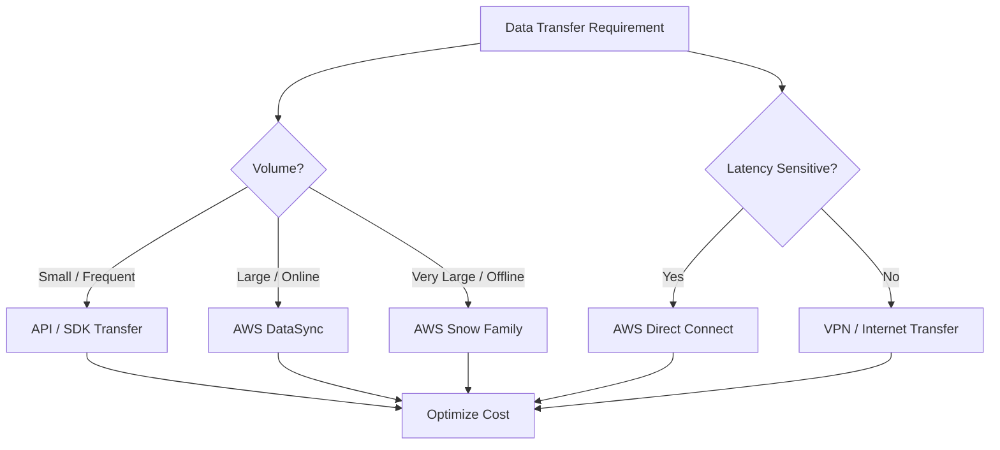

# AWS Cost-Effective Data Transfer Blueprint

A decision framework for selecting the right AWS data transfer pattern.

## Diagram

```mermaid
flowchart TD
    D[Data Transfer Requirement] --> V{Volume?}
    V -->|Small / Frequent| API[API / SDK Transfer]
    V -->|Large / Online| DT[AWS DataSync]
    V -->|Very Large / Offline| SB[AWS Snow Family]
    D --> L{Latency Sensitive?}
    L -->|Yes| DX[AWS Direct Connect]
    L -->|No| VPN[VPN / Internet Transfer]
    API --> O[Optimize Cost]
    DT --> O
    SB --> O
    DX --> O
    VPN --> O
```
