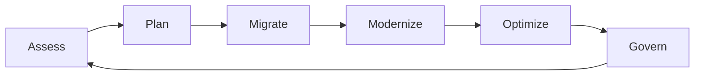

# AWS Modernization Framework

A high-level enterprise modernization lifecycle.

## Diagram

## Stages

- Assess: portfolio, risk, dependencies, business drivers
- Plan: landing zone, migration waves, operating model
- Migrate: rehost, replatform, refactor
- Modernize: containers, serverless, managed services, data platforms
- Optimize: cost, performance, reliability, security
- Govern: policies, tagging, guardrails, compliance
