# Route 53 Domain Migration Blueprint

A structured flow for migrating a domain from an external registrar to Amazon Route 53.

## Diagram

```mermaid
flowchart LR
    G[Existing Registrar] --> U[Unlock Domain]
    U --> A[Get Authorization Code]
    A --> R[Start Transfer in Route 53]
    R --> V[Verify Contact / Email]
    V --> Z[Create Hosted Zone]
    Z --> N[Update Name Servers]
    N --> T[Test DNS Resolution]
    T --> C[Complete Migration]
```

## Checklist

- Confirm domain eligibility
- Disable transfer lock
- Capture existing DNS records
- Lower TTL before migration
- Create hosted zone in Route 53
- Validate records before cutover
